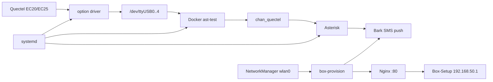

# Turn an ARMv7 TV box into an SMS notification gateway: Asterisk, Quectel, and Bark

English is the primary guide. For the Chinese version, see [README.zh-CN.md](README.zh-CN.md).

Flash the spare TV box with Linux, attach a Quectel module, receive SMS with Asterisk, and forward notifications to a phone through Bark.

The example uses a Huawei Yuebox EC6108V9C / Hi3798MV100-class ARMv7 device, a Quectel EC20F/EC25-series module, and USB ID `2c7c:0125`. Board model, wireless chipset, module firmware, and port numbering may differ; probe the actual device before deployment.

## 1. Prepare the hardware and understand each component

| Item | Environment or convention used in this guide |
| ------ | --------------------------------------- |
| TV box | Huawei Yuebox EC6108V9C; verify the actual SoC and board |
| System | HiNAS 32-bit, Ubuntu 20.04.6 LTS |
| Kernel and architecture | `4.4.35_ecoo_81092768`, `armv7l` |
| Cellular module | A compatible Quectel EC20 / EC25 family model; verify firmware and interfaces |
| USB identifier | `2c7c:0125` in this example; use the actual `lsusb` result |
| Power | A separately powered USB hub is recommended for stable module power |
| Computer | Windows, macOS, or Linux; keep a wired connection during first-time setup |
| Notification client | An iPhone with Bark installed and your own Bark Device Key |

Verify the exact board before flashing. Do not choose firmware from the enclosure name alone: Hi3797 and Hi3798 may use different kernels, Wi-Fi drivers, and flashing procedures.

### Verified runtime profile

After deployment, use these checks to determine whether the system matches the validated profile:

| Item | Expected result |
| -------- | ------------------------------------------------------------ |
| Host | Ubuntu 20.04.6, ARMv7, legacy 4.4 kernel |
| Wireless | `wlan0` managed by NetworkManager; Ethernet available as a recovery path |
| Cellular module | `lsusb` shows `2c7c:0125`; the `option` driver binds `ttyUSB0` through `ttyUSB4` |
| Docker | `asterisk-quectel:armv7` image, `ast-test` container, host networking, five serial devices mapped |
| Asterisk | 20.6.0; `chan_quectel.so` reports `Running` |
| Provisioning | `box-provision.service` listens on `127.0.0.1:8765`; Nginx proxies only the setup-hotspot subnet |


The system can be understood as two flows:

```text
SMS: SIM card → Quectel module → host `option` driver → ttyUSB
     → Docker device mapping → chan_quectel → Asterisk → Bark → phone

Management: power on → try saved Wi-Fi → success: Bark reports the IP
                                  └→ failure: enable the Box-Setup hotspot → web provisioning
```



The USB driver is managed by the host kernel. A container can use only devices already recognized by the host, so placing `echo ... > new_id` inside the container cannot fix missing serial ports during container creation.

This guide builds the SMS gateway first and then installs the optional web provisioning service. Linux commands assume **Bash**; service installation, writes under `/etc`, and USB binding run from the box's root shell. On Windows, build images from WSL Bash and switch Docker Desktop to Linux containers.

## 2. Flash the box and establish the first SSH connection

Use the platform documentation for firmware and the exact flashing procedure:

- [Firmware downloads](https://www.ecoo.top/download)
- [TV-box flashing guide](https://www.ecoo.top/docs/category/%E6%9C%BA%E9%A1%B6%E7%9B%92%E5%88%B7%E6%9C%BA%E6%95%99%E7%A8%8B)

After flashing, connect the box to the computer by Ethernet and share the computer's Wi-Fi connection to Ethernet. Windows Internet Connection Sharing often uses `192.168.137.0/24`, but DHCP assigns the box address; do not copy another device's address.

Find neighboring devices from Windows PowerShell:

```powershell
Get-NetNeighbor -AddressFamily IPv4
arp -a
```

Connect after finding the box IP. The address below is an example; replace it:

```bash
ssh root@192.168.137.100
```

Record system information and set your own login password after signing in:

```bash
uname -a
uname -m
cat /etc/os-release
ip -br address
passwd
```

Install the basic tools. If Docker is already present, keep that installation instead of installing a second one:

```bash
apt update
apt install -y kmod usbutils curl ca-certificates python3 jq \
  network-manager openssh-server avahi-daemon nginx git
systemctl enable --now ssh NetworkManager avahi-daemon
docker version
docker info
```

If `docker` is not installed, prefer the firmware's ARMv7/legacy-kernel instructions. When the distribution provides a compatible package, use `apt install docker.io` followed by `systemctl enable --now docker`. A Docker client alone is insufficient; `docker info` must reach the daemon.

Before building or running images, confirm that the architecture was not misdetected as `amd64`:

```bash
docker version --format 'server={{.Server.Version}} client={{.Client.Version}}'
docker info --format 'arch={{.Architecture}} os={{.OperatingSystem}} kernel={{.KernelVersion}}'
```

The validated device uses Docker 26.1.3, `armv7l`, and a 4.4.35 kernel. A newer Docker may run on an old kernel, but that does not make every new image compatible; check libc, device permissions, and kernel features when containers fail to start.

Use a temporary password for the first login. After verifying public-key access, disable root password login or at least restrict the SSH source subnet:

```bash
install -d -m 0700 /root/.ssh
chmod 0600 /root/.ssh/authorized_keys
sshd -t
```

Keep an authenticated recovery session open while editing `sshd_config`, and verify the key in a new session. Do not restart SSH from your only connection.

### 2.1 Verify the Wi-Fi driver and connection profile

```bash
nmcli device status
ip -br link
```

If the firmware lacks a Wi-Fi driver, inspect the driver script for Hi3798MV100. Read it first and confirm the board/kernel match before running it:

```bash
git clone https://gitee.com/xjxjin/scripts.git
cd scripts
less install_hi3798mv100_wifi.sh
sudo ./install_hi3798mv100_wifi.sh
sudo depmod -a
```

Do not hard-code one device's `/lib/modules/4.4.35_...` path for every box. The module directory must match `uname -r`; creating a directory alone cannot supply a missing driver.

You can configure Wi-Fi over the wired SSH connection:

```bash
nmcli device wifi rescan ifname wlan0
nmcli device wifi list ifname wlan0
nmcli --ask device wifi connect 'MyHomeWiFi' ifname wlan0 name home-wifi
nmcli connection modify home-wifi connection.autoconnect yes
nmcli connection modify home-wifi ipv4.route-metric 50
```

`MyHomeWiFi` is an example SSID and `home-wifi` is the NetworkManager connection name; they do not have to match. `connection modify` accepts a profile name or UUID. A lower route metric has higher priority; choose Wi-Fi versus Ethernet priority for your network.

Connection changes usually take effect on the next activation. Keep Ethernet connected during remote setup and run `nmcli connection up home-wifi`; restarting NetworkManager can interrupt the current SSH session.

## 3. Make ttyUSB devices appear on the host

### 3.1 Distinguish USB enumeration from serial binding

First check whether the module is recognized on the USB bus:

```bash
lsusb
lsusb -t
dmesg | tail -80
```

This device uses VID/PID `2c7c:0125` and appeared as EC20F in Asterisk. A USB ID alone cannot confirm the hardware variant; use the module label or the `ATI` AT command when necessary.

If `lsusb` lists the device but `/dev/ttyUSB*` is absent, run this on the **host**:

```bash
modprobe usbserial
modprobe option
echo 2c7c 0125 > /sys/bus/usb-serial/drivers/option1/new_id
sleep 2
ls -l /dev/ttyUSB*
dmesg | tail -50
```

The tested device ultimately exposed `/dev/ttyUSB0` through `/dev/ttyUSB4`. Other firmware may expose a different USB interface set; do not treat five ports as a fixed EC20/EC25 specification.

`new_id` registers a device ID with the running driver. This dynamic registration is not a persistent boot configuration. Do not use `cat .../new_id` to decide whether binding succeeded; inspect character devices, driver links, and kernel logs.

When using a non-root shell, the redirection still needs root privileges:

```bash
printf '2c7c 0125\n' | sudo tee /sys/bus/usb-serial/drivers/option1/new_id >/dev/null
```

**If `lsusb` does not show the module at all, check power, the data cable, and the USB hub first.** Some devices enumerate their USB module long after boot; writing `new_id` cannot make an unenumerated device appear. Check the hardware and kernel USB logs first.

### 3.2 Create a preparation script that runs on every boot

Create `/usr/local/sbin/quectel-usb-prepare.sh`:

```bash
cat > /usr/local/sbin/quectel-usb-prepare.sh <<'EOF'
#!/bin/sh
set -eu
PATH=/usr/sbin:/usr/bin:/sbin:/bin

# Vendor kernels may have built-in drivers without separate module files.
modprobe usbserial 2>/dev/null || true
modprobe option 2>/dev/null || true
new_id=/sys/bus/usb-serial/drivers/option1/new_id
if [ ! -w "$new_id" ]; then
    echo "Quectel: option driver new_id is unavailable" >&2
    exit 1
fi

# Always register the VID/PID before starting the container.
# Some kernels reject duplicate registrations; readiness is checked below.
if ! { echo 2c7c 0125 > "$new_id"; } 2>/dev/null; then
    echo "Quectel: new_id write did not succeed; checking existing binding" >&2
fi

attempt=0
while [ "$attempt" -lt 30 ]; do
    ready=1
    for port in 0 1 2 3 4; do
        dev="/dev/ttyUSB$port"
        if [ ! -c "$dev" ]; then
            ready=0
            break
        fi
        props=$(udevadm info --query=property --name="$dev" 2>/dev/null || true)
        if ! printf '%s\n' "$props" | grep -qx 'ID_VENDOR_ID=2c7c' ||
           ! printf '%s\n' "$props" | grep -qx 'ID_MODEL_ID=0125'; then
            ready=0
            break
        fi
    done
    if [ "$ready" -eq 1 ]; then
        echo "Quectel: ttyUSB0..4 are ready"
        exit 0
    fi
    attempt=$((attempt + 1))
    sleep 1
done
echo "Quectel: required serial devices did not become ready" >&2
exit 1
EOF
chmod 0755 /usr/local/sbin/quectel-usb-prepare.sh
/usr/local/sbin/quectel-usb-prepare.sh
```

On every run the script attempts the essential `echo`, then checks that all five ports are character devices belonging to the target VID/PID. Some vendor kernels build the driver in, so the presence of the `new_id` interface matters more than the `modprobe` return value. If the ports are not ready after about 30 seconds, the script fails and the later systemd unit retries.

This assumes one cellular module with fixed ports `ttyUSB0–4`. With multiple USB serial devices, create stable aliases from `/dev/serial/by-id/` or USB interface numbers and update the preparation script, container mapping, and `quectel.conf` together.

## 4. Build the ARMv7 Asterisk + chan_quectel image

This section gives a reproducible reference path: compile `chan_quectel` in a container using Debian Bullseye Asterisk and matching development headers. You do not need to compile all of Asterisk on the TV box. The target runs Asterisk 20.6.0, so `--with-astversion` must exactly match the version inside the image.

This guide uses the public [IchthysMaranatha/asterisk-chan-quectel](https://github.com/IchthysMaranatha/asterisk-chan-quectel) repository and pins one commit. In production, record the tested commit, base-image digest, and Asterisk version together.

### 4.1 Create the Dockerfile

Run this on the image-building computer or an ARMv7 device:

```bash
mkdir -p ast-build
cd ast-build
cat > Dockerfile <<'EOF'
FROM debian:bullseye
ARG DEBIAN_FRONTEND=noninteractive
ARG QUECTEL_REF=3d45c7f072131296a7e3c1a4faf5bb18751dbd87

RUN apt-get update \
 && apt-get install -y --no-install-recommends \
      asterisk asterisk-dev python3 ca-certificates curl \
      libasound2 libsqlite3-0 \
      build-essential autoconf automake libtool pkg-config git \
      libsqlite3-dev libasound2-dev \
 && git clone https://github.com/IchthysMaranatha/asterisk-chan-quectel.git /usr/src/chan-quectel \
 && cd /usr/src/chan-quectel \
 && git checkout --detach "$QUECTEL_REF" \
 && ./bootstrap \
 && AST_VERSION="$(asterisk -V | sed -n 's/^Asterisk \([0-9][0-9.]*\).*/\1/p')" \
 && test -n "$AST_VERSION" \
 && ./configure --with-astversion="$AST_VERSION" \
      --with-asterisk=/usr/include DESTDIR=/usr/lib/asterisk/modules \
 && make -j2 \
 && make install \
 && mkdir -p /usr/local/share/quectel /run/asterisk /etc/box-provision \
 && cp etc/quectel.conf /usr/local/share/quectel/quectel.conf.sample \
 && printf '%s\n' "$QUECTEL_REF" > /usr/local/share/quectel/source-revision \
 && dpkg-query -W asterisk > /usr/local/share/quectel/asterisk-package-version \
 && apt-get purge -y --auto-remove \
      asterisk-dev build-essential autoconf automake libtool pkg-config git \
      libsqlite3-dev libasound2-dev \
 && rm -rf /usr/src/chan-quectel /var/lib/apt/lists/*

# systemd on the host starts and supervises Asterisk through docker exec.
CMD ["tail", "-f", "/dev/null"]
EOF
```

`--with-astversion` must match the Asterisk version actually installed in the container; do not hard-code the example version from this README. `libasound2-dev` builds the ALSA support included by this branch; `libasound2` remains at runtime.

The Dockerfile pins the driver commit but not the base-image digest or distribution package versions. It uses the Asterisk version available from Debian Bullseye; after building, verify it with `docker run --rm asterisk-quectel:armv7 asterisk -V` and keep `--with-astversion` aligned. The target environment was validated with Asterisk 20.6.0; if the builder produces another version, do not treat it as a drop-in replacement. Rebuild with a pinned Asterisk 20.6.0 package or source. For repeatable builds, also save the base-image digest and distribution package versions; rebuild the matching driver after upgrading Asterisk.

### 4.2 Choose the correct build platform

On native ARMv7 Linux, build directly:

```bash
docker build -t asterisk-quectel:armv7 .
```

On Docker Desktop for Windows/macOS or a Linux builder configured for ARM emulation:

```bash
docker buildx inspect --bootstrap
docker buildx build --platform linux/arm/v7 --load \
  -t asterisk-quectel:armv7 .
docker image inspect asterisk-quectel:armv7 \
  --format '{{.Os}}/{{.Architecture}}/{{.Variant}}'
```

The builder must support `linux/arm/v7`. Using only `debian:bullseye` does not make an x86 computer produce an ARM image, and `--platform` does not configure every emulator automatically. If the Docker version lacks Buildx, build on a native ARMv7 machine.

Copy the image to the box. Set the real address first:

```bash
BOX_ADDR=192.168.137.100
docker save asterisk-quectel:armv7 | gzip > asterisk-quectel-armv7.tar.gz
scp asterisk-quectel-armv7.tar.gz "root@$BOX_ADDR:/root/"
```

Import it on the box:

```bash
gzip -dc /root/asterisk-quectel-armv7.tar.gz | docker load
docker run --rm asterisk-quectel:armv7 asterisk -V
```

The temporary version-check container does not use USB, so it needs no serial mapping. The later `ast-test` container that uses the cellular module must prepare USB first.

## 5. Prepare persistent configuration and Bark notifications

### 5.1 Create data directories

These steps target a new deployment. Back up the existing configuration and container metadata on devices that already have `ast-test`; do not overwrite them directly.

```bash
install -d -m 0755 /opt/asterisk/etc /opt/asterisk/bin
install -d -m 0755 /opt/asterisk/lib /opt/asterisk/log /opt/asterisk/spool
install -d -m 0700 /etc/box-provision

docker create --name ast-config-seed asterisk-quectel:armv7
docker cp ast-config-seed:/etc/asterisk/. /opt/asterisk/etc/
docker cp ast-config-seed:/var/lib/asterisk/. /opt/asterisk/lib/
docker cp ast-config-seed:/var/spool/asterisk/. /opt/asterisk/spool/
docker rm ast-config-seed
```

Extract the default configuration from the image before binding directories. Mounting an empty directory on `/etc/asterisk` hides all configuration shipped in the image.

### 5.2 Store the Bark key

Enter your own key in the box's Bash; input is hidden:

```bash
read -r -s -p 'Bark Device Key: ' BARK_DEVICE_KEY
printf '\n'
test -n "$BARK_DEVICE_KEY" && \
  (umask 077; printf '%s\n' "$BARK_DEVICE_KEY" > /etc/box-provision/bark-key)
unset BARK_DEVICE_KEY
```

Keep the key on the host and mount it read-only into the container. Never put a real key in the Dockerfile, screenshots, or a document intended for publication.

### 5.3 Install the shared notification script

Create `/opt/asterisk/bin/bark-notify` for both host network notifications and SMS notifications inside the container:

```bash
cat > /opt/asterisk/bin/bark-notify <<'EOF'
#!/usr/bin/python3
import base64
import json
import sys
import time
from pathlib import Path
from urllib.request import Request, urlopen

def main():
    if len(sys.argv) != 4:
        raise ValueError("usage: bark-notify TITLE BODY GROUP | --sms SENDER BASE64")
    if sys.argv[1] == "--sms":
        sender, encoded = sys.argv[2:4]
        body = base64.b64decode(encoded, validate=True).decode("utf-8", errors="replace")
        title, group = "SMS: " + (sender or "Unknown number"), "SMS"
    else:
        title, body, group = sys.argv[1:4]
    key = Path("/etc/box-provision/bark-key").read_text(encoding="utf-8").strip()
    if not key:
        raise ValueError("empty Bark key")
    payload = json.dumps({
        "device_key": key, "title": title, "body": body,
        "group": group, "ttl": 600,
    }, ensure_ascii=False).encode("utf-8")
    for attempt in range(3):
        try:
            request = Request("https://api.day.app/push", data=payload,
                              headers={"Content-Type": "application/json"}, method="POST")
            with urlopen(request, timeout=10) as response:
                result = json.load(response)
            if result.get("code") != 200:
                raise RuntimeError("Bark did not accept the notification")
            return
        except Exception:
            if attempt == 2:
                raise
            time.sleep(2 ** attempt)

if __name__ == "__main__":
    try:
        main()
    except Exception as exc:
        # Keep keys, message bodies and phone numbers out of diagnostic logs.
        print("Bark notification failed: " + type(exc).__name__, file=sys.stderr)
        sys.exit(1)
EOF
chmod 0755 /opt/asterisk/bin/bark-notify
ln -sfn /opt/asterisk/bin/bark-notify /usr/local/bin/bark-notify
/usr/local/bin/bark-notify 'Box notification test' 'Bark setup succeeded' box
```

JSON serialization handles quotes, newlines, and non-ASCII SMS correctly; concatenating SMS text into shell-built JSON can create invalid requests. The script checks both the HTTP request and Bark's application status so failures are not reported as successes.

`group` controls notification grouping. `ttl` concerns push expiry; it is not the local retry delay or SMS deletion time. This simplified script tries at most three times and has no persistent delivery queue; add a local queue and delivery records when reliable replay is required.

Do not put the key in `notify.sh`, Asterisk configuration, or an image layer. Deleting the string later cannot revoke credentials already exposed in a built image; rotate the key in Bark first, then rebuild or mount the replacement through a read-only file.

## 6. Configure chan_quectel and the SMS dial plan

### 6.1 Choose data and audio ports

A common EC20/EC25 configuration is:

```ini
data=/dev/ttyUSB2
audio=/dev/ttyUSB1
```

These are interface examples, not a universal numbering scheme. `data` is the AT-command port; `audio` is the serial audio interface supported by the firmware. UAC mode also needs an audio device and matching configuration. This guide targets SMS reception and does not guarantee voice calls, VoLTE, or a particular audio mode.

Create `/opt/asterisk/etc/quectel.conf`:

```bash
cat > /opt/asterisk/etc/quectel.conf <<'EOF'
[general]
interval=15
smsdb=/var/lib/asterisk/smsdb
csmsttl=600

[defaults]
context=incoming-mobile
group=0
rxgain=0
txgain=0
disablesms=no
autodeletesms=no
resetquectel=yes
u2diag=-1
usecallingpres=yes
callingpres=allowed_passed_screen
language=en
initstate=start

[quectel0]
data=/dev/ttyUSB2
audio=/dev/ttyUSB1
context=from-quectel
EOF
```

The example starts with `autodeletesms=no` so module SMS messages remain available during debugging. Long-running deployments must manage message-store capacity; with `yes`, driver deletion and Bark delivery are not atomic and cannot act as a reliable queue. Do not copy module-reported IMEI/IMSI values into the configuration; unsupported `auto` values produce warnings, so omitting these options is safer.

### 6.2 Pass only filtered arguments to external scripts

Create `/opt/asterisk/etc/extensions.conf`. This replaces the default dial plan in a new deployment:

```bash
cat > /opt/asterisk/etc/extensions.conf <<'EOF'
[general]
static=yes
writeprotect=yes

[from-quectel]
exten => sms,1,NoOp(Forward incoming SMS to Bark)
 same => n,Set(SAFE_SENDER=${FILTER(0-9+,${CALLERID(num)})})
 same => n,Set(SMS_B64=${BASE64_ENCODE(${SMS})})
 same => n,System(/usr/local/bin/bark-notify --sms "${SAFE_SENDER}" "${SMS_B64}")
 same => n,NoOp(Bark command result: ${SYSTEMSTATUS})
 same => n,Hangup()

; This example does not route voice calls or send outgoing SMS.
exten => s,1,Hangup()
exten => _X.,1,Hangup()
exten => ussd,1,Hangup()
EOF
```

The current driver puts the SMS body in `${SMS}`. The dial plan first encodes it with `BASE64_ENCODE()` so the argument contains safe characters, then the Python script decodes it and creates JSON. Never place `${SMS}` or decoded `${BASE64_DECODE(...)}` text directly in `System()`: SMS is external input and may contain shell metacharacters.

The example filters the number, so a sender name containing Chinese characters or punctuation may not be preserved fully. To keep the complete field, use AGI and pass data through its protocol instead of putting unfiltered content into a shell command.

### 6.3 Control loaded modules and configuration permissions

Use this in a new `/opt/asterisk/etc/modules.conf`:

```ini
[modules]
autoload=yes
load=chan_quectel.so
noload=chan_sip.so
noload=chan_pjsip.so
noload=res_pjsip.so
noload=chan_iax2.so
noload=res_http_websocket.so
noload=cdr_sqlite3_custom.so
noload=cel_sqlite3_custom.so
```

Ensure `[general]` in `/opt/asterisk/etc/manager.conf` has `enabled=no`, and `[general]` in `/opt/asterisk/etc/http.conf` also has `enabled=no`. An SMS gateway does not need public AMI, ARI, SIP, or IAX services. With `autoload=yes`, different versions may still load other modules, so inspect listening ports after startup.

```bash
chown -R root:root /opt/asterisk/etc /opt/asterisk/bin /etc/box-provision
find /opt/asterisk/etc -type d -exec chmod 0755 {} +
find /opt/asterisk/etc -type f -exec chmod 0644 {} +
chmod 0700 /etc/box-provision
chmod 0600 /etc/box-provision/bark-key
```

At boot, `cdr_sqlite3_custom` and `cel_sqlite3_custom` may refuse to load while `Asterisk Ready` still appears. Those messages alone do not prove startup failed; explicitly disable these backends when they are not used.

## 7. Create the container and let systemd control startup order

### 7.1 Create the USB-enabled service container

Run the preparation script successfully before creating the container:

```bash
/usr/local/sbin/quectel-usb-prepare.sh && \
docker create --name ast-test \
  --restart=no \
  --network host \
  --device=/dev/ttyUSB0:/dev/ttyUSB0:rwm \
  --device=/dev/ttyUSB1:/dev/ttyUSB1:rwm \
  --device=/dev/ttyUSB2:/dev/ttyUSB2:rwm \
  --device=/dev/ttyUSB3:/dev/ttyUSB3:rwm \
  --device=/dev/ttyUSB4:/dev/ttyUSB4:rwm \
  --mount type=bind,src=/opt/asterisk/etc,dst=/etc/asterisk,readonly \
  --mount type=bind,src=/opt/asterisk/lib,dst=/var/lib/asterisk \
  --mount type=bind,src=/opt/asterisk/log,dst=/var/log/asterisk \
  --mount type=bind,src=/opt/asterisk/spool,dst=/var/spool/asterisk \
  --mount type=bind,src=/opt/asterisk/bin/bark-notify,dst=/usr/local/bin/bark-notify,readonly \
  --mount type=bind,src=/etc/box-provision/bark-key,dst=/etc/box-provision/bark-key,readonly \
  --log-driver json-file --log-opt max-size=5m --log-opt max-file=3 \
  asterisk-quectel:armv7
```

This uses no `--privileged`; only the required serial devices are mapped. `--network host` follows the original deployment, so services listening inside the container may be reachable on the box address; keep the service shutdown and port checks above.

`--restart=no` is part of the startup ordering: systemd starts the service container after USB preparation, instead of Docker performing an early automatic restart. Inspect an existing container with `docker inspect`, then use `docker update --restart=no ast-test` to hand lifecycle control to systemd.

The working container is named `ast-test`, uses image `asterisk-quectel:armv7`, runs `tail -f /dev/null`, and lets host systemd run Asterisk in the foreground through `docker exec`. It uses host networking, no `--privileged`, and maps `/dev/ttyUSB0` through `/dev/ttyUSB4`. This “userspace in a container, main process supervised by systemd” layout works, but configuration ships with the image; rebuild or recreate the container when upgrading it. The example adds read-only configuration and Bark-key mounts for rotation and backup.

### 7.2 Install the pre-start check

Create `/usr/local/sbin/ast-test-security-check`:

```bash
cat > /usr/local/sbin/ast-test-security-check <<'EOF'
#!/bin/bash
set -euo pipefail
spec=$(docker inspect ast-test)

jq -e '.[0] |
  .Config.Image == "asterisk-quectel:armv7" and
  .HostConfig.Privileged == false and
  .HostConfig.RestartPolicy.Name == "no" and
  .HostConfig.NetworkMode == "host" and
  ([.Mounts[] | select(.Destination == "/etc/asterisk" and .RW == false)] | length == 1) and
  ([.Mounts[] | select(.Destination == "/etc/box-provision/bark-key" and .RW == false)] | length == 1)
' <<< "$spec" >/dev/null

for port in 0 1 2 3 4; do
    dev="/dev/ttyUSB$port"
    test -c "$dev"
    jq -e --arg dev "$dev" 'any(.[0].HostConfig.Devices[];
      .PathOnHost == $dev and .PathInContainer == $dev)' <<< "$spec" >/dev/null
done

test -f /opt/asterisk/etc/quectel.conf
test -f /opt/asterisk/etc/extensions.conf
test -x /opt/asterisk/bin/bark-notify
test -s /etc/box-provision/bark-key
test "$(stat -c '%u:%g %a' /etc/box-provision/bark-key)" = "0:0 600"
unsafe=$(find /opt/asterisk/etc -xdev -perm /022 -print -quit)
test -z "$unsafe" || { echo "Unsafe Asterisk configuration permissions" >&2; exit 1; }
echo "Asterisk container configuration checks passed"
EOF
chmod 0755 /usr/local/sbin/ast-test-security-check
```

It checks the image name, privileged mode, restart policy, device mappings, and configuration permissions. The image-name check prevents using the wrong image; it does not verify signatures or provenance and is not a complete security audit.

### 7.3 Install the Asterisk startup service

Create `/etc/systemd/system/ast-test-asterisk.service`:

```ini
[Unit]
Description=Asterisk with Quectel in Docker
Wants=docker.service
After=docker.service
StartLimitIntervalSec=0

[Service]
Type=simple
ExecStartPre=/usr/local/sbin/quectel-usb-prepare.sh
ExecStartPre=/usr/local/sbin/ast-test-security-check
ExecStartPre=/bin/sh -c 'running=$$(/usr/bin/docker inspect -f "{{.State.Running}}" ast-test 2>/dev/null || true); if [ "$$running" != "true" ]; then /usr/bin/docker start ast-test; fi'
ExecStartPre=/usr/bin/docker exec ast-test /bin/sh -c 'for n in 0 1 2 3 4; do test -c /dev/ttyUSB$$n || exit 1; done'
ExecStart=/usr/bin/docker exec ast-test /usr/sbin/asterisk -f -U root -G root
ExecStop=-/usr/bin/docker exec ast-test /usr/sbin/asterisk -rx "core stop gracefully"
ExecStopPost=-/usr/bin/docker stop -t 10 ast-test
Restart=always
RestartSec=15
TimeoutStartSec=90
TimeoutStopSec=30
KillMode=process

[Install]
WantedBy=multi-user.target
```

The reference order is:

```text
load driver → write new_id on every run → wait for and verify ttyUSB
        → check container configuration → docker start → verify container serial ports → run Asterisk in foreground
```

Keep `StartLimitIntervalSec=0` in `[Unit]`. `$$n` in the unit file passes `$n` to the inner shell without systemd treating it as an environment variable. If a pre-start check fails, `docker start` is skipped; the service retries after 15 seconds. A late USB module affects only this service and does not block Docker itself.

`asterisk -f` keeps Asterisk in the foreground so systemd can observe its exit through `docker exec`. `ExecStopPost` stops the service container so the next start recreates device mappings; `Restart=always` recovers normal or abnormal exits, while an administrator's `systemctl stop` does not immediately restart it.

The reference unit runs USB preparation and security checks, starts `ast-test` if needed, and then runs Asterisk. On an existing device, compare the actual order with `systemctl cat ast-test-asterisk.service`; the service log should show the security check passing. If Docker's restart policy remains `always`, a Docker daemon restart may bypass systemd pre-checks. To guarantee that `new_id` is written before every container start, set the container policy to `no` and let systemd own its lifecycle.

Enable the service:

```bash
systemctl daemon-reload
systemctl enable --now ast-test-asterisk.service
systemctl status ast-test-asterisk.service --no-pager -l
```

Use this entry point from now on:

```bash
systemctl restart ast-test-asterisk.service
```

**Running `docker start ast-test` or `docker restart ast-test` directly bypasses these pre-start steps.** Docker does not automatically invoke this systemd unit; the “echo first every time” guarantee depends on using this entry point and disabling Docker's automatic restart policy.

### 7.4 Verify the service, not only the container state

```bash
docker exec ast-test ls -l /dev/ttyUSB0 /dev/ttyUSB1 /dev/ttyUSB2 /dev/ttyUSB3 /dev/ttyUSB4
docker exec ast-test asterisk -rx 'core show uptime'
docker exec ast-test asterisk -rx 'module show like chan_quectel'
docker exec ast-test asterisk -rx 'quectel show devices'
docker exec ast-test asterisk -rx 'dialplan show from-quectel'
journalctl -u ast-test-asterisk.service -n 80 --no-pager
ss -lntup
```

`Up` in `docker ps` only means this example's `sleep infinity` is still running; it does not prove Asterisk or the cellular module is healthy. After the module registers, send a test SMS to the SIM and verify the Bark content.


## 8. Optional: configure Wi-Fi through a web page and notify the IP

### 8.1 Limitations of single-radio switching

This box's Wi-Fi radio handles both the setup hotspot and the router connection. Common legacy drivers cannot reliably operate AP and STA at the same time, and scan results may be incomplete while the hotspot is active.

Recommended flow:

1. On boot, try the saved normal Wi-Fi and wait only a limited time.
2. If no connection is available, enable the `Box-Setup` hotspot.
3. Connect a phone or computer to the hotspot and open `http://192.168.50.1`.
4. Let the page acknowledge the request, then let the backend stop the hotspot and switch to the target Wi-Fi.
5. Bark reports the address on success; failure restores the hotspot.
6. After the computer joins the target Wi-Fi, SSH using the notified IP or the `.local` hostname.

The browser disconnects when the hotspot stops, so it cannot reliably receive the IP on the new network. Polling the page continuously cannot remove that link break. Without Internet access, Bark cannot deliver; recover the box from the router's DHCP lease or by Ethernet.

### 8.2 Create a password-protected setup hotspot

First verify AP support, and update later configuration if the interface is not `wlan0`. The validated device uses a Realtek USB adapter and `wlan0`; NetworkManager's `Box-Setup` is a shared AP at `192.168.50.1/24` with autoconnect disabled.

```bash
apt install -y iw
iw list
nmcli device status
```

Look for `AP` under `Supported interface modes`. The configuration below fixes 2.4 GHz and prevents the hotspot from automatically taking priority over normal Wi-Fi:

```bash
nmcli connection add type wifi ifname wlan0 con-name Box-Setup ssid Box-Setup
nmcli connection modify Box-Setup \
  802-11-wireless.mode ap 802-11-wireless.band bg \
  ipv4.method shared ipv4.addresses 192.168.50.1/24 \
  ipv6.method disabled connection.autoconnect no
read -r -s -p 'Set an 8–63 character ASCII hotspot password: ' SETUP_PSK
printf '\n'
nmcli connection modify Box-Setup wifi-sec.key-mgmt wpa-psk wifi-sec.psk "$SETUP_PSK"
unset SETUP_PSK
```

If a hotspot with this name already exists, modify it instead of creating a duplicate. NetworkManager shared mode provides DHCP and sharing; some distributions also need `dnsmasq-base`, but do not start another DHCP service on the same ports. An open hotspot is suitable only for first-time recovery; use WPA2-PSK for long-term operation and document the hotspot password in the page.

Inspect existing web sites before configuring the hotspot. One Nginx instance can have only one default server for a port; do not let an existing PHP, WebDAV, or public-domain site take over the provisioning page. The provisioning box needs one server block restricted by source subnet; disable other sites or bind them to another port.

The provisioning page accepts the target Wi-Fi password, so the hotspot itself should use WPA2-PSK and allow only your own devices.

### 8.3 Install the standalone provisioning service

The simplified service below follows the tested flow and supports open networks plus WPA/WPA2 personal networks. It creates the target Wi-Fi profile and activates it directly instead of rejecting a network merely because its SSID is absent from the current scan list. Hidden SSIDs use active probing; WPA enterprise and WPA3-only networks are outside this example.

It validates with a temporary profile, then replaces the last profile it created on success; other Wi-Fi profiles remain untouched. The hotspot does not auto-refresh the network list, so enter the SSID directly.

Create `/usr/local/libexec/box-provision.py`:

```bash
install -d -m 0755 /usr/local/libexec
cat > /usr/local/libexec/box-provision.py <<'EOF'
#!/usr/bin/python3
import json
import os
import subprocess
import threading
import time
from http.server import BaseHTTPRequestHandler, ThreadingHTTPServer

DEVICE = "wlan0"
AP = "Box-Setup"
ACTIVE = "box-managed-wifi"
PENDING = "box-pending-wifi"
busy = threading.Lock()

def run(*args, timeout=20):
    result = subprocess.run(args, stdout=subprocess.PIPE, stderr=subprocess.DEVNULL,
                            text=True, timeout=timeout, env={**os.environ, "LC_ALL": "C"})
    if result.returncode:
        raise RuntimeError("command failed")
    return result.stdout.strip()

def best_effort(*args):
    try:
        run(*args)
    except (RuntimeError, OSError, subprocess.TimeoutExpired):
        pass

def profile():
    return run("nmcli", "-g", "GENERAL.CONNECTION", "device", "show", DEVICE)

def current_connection():
    state = run("nmcli", "-g", "GENERAL.STATE", "device", "show", DEVICE)
    name = profile()
    if not state.startswith("100") or name in (AP, "", "--"):
        return None
    addresses = run("nmcli", "-g", "IP4.ADDRESS", "device", "show", DEVICE)
    for line in addresses.splitlines():
        address = line.split("/", 1)[0]
        if address and address != "192.168.50.1":
            return name, address
    return None

def connect(ssid, password):
    try:
        time.sleep(1)  # Allow the HTTP 202 response to leave the interface.
        best_effort("nmcli", "connection", "delete", PENDING)
        run("nmcli", "connection", "add", "type", "wifi", "ifname", DEVICE,
            "con-name", PENDING, "ssid", ssid,
            "connection.autoconnect", "no", "802-11-wireless.hidden", "yes")
        if password:
            run("nmcli", "connection", "modify", PENDING,
                "wifi-sec.key-mgmt", "wpa-psk", "wifi-sec.psk", password)
        run("nmcli", "connection", "modify", PENDING, "ipv4.method", "auto",
            "ipv4.route-metric", "50", "connection.autoconnect-priority", "10")
        best_effort("nmcli", "connection", "down", AP)
        best_effort("nmcli", "device", "wifi", "rescan", "ifname", DEVICE)
        run("nmcli", "--wait", "45", "connection", "up", PENDING,
            "ifname", DEVICE, timeout=55)
        result = current_connection()
        if not result or result[0] != PENDING:
            raise RuntimeError("no IPv4 address")
        best_effort("nmcli", "connection", "delete", ACTIVE)
        run("nmcli", "connection", "modify", PENDING, "connection.id", ACTIVE,
            "connection.autoconnect", "yes")
        print("Wi-Fi connected; network notification will follow", flush=True)
    except (RuntimeError, OSError, subprocess.TimeoutExpired):
        best_effort("nmcli", "connection", "delete", PENDING)
        best_effort("nmcli", "connection", "up", AP)
        print("Wi-Fi setup failed; restoring setup hotspot", flush=True)
    finally:
        busy.release()

PAGE = """<!doctype html><html lang="en"><meta charset="utf-8">
<meta name="viewport" content="width=device-width,initial-scale=1">
<title>Box Wi-Fi setup</title><style>body{max-width:32rem;margin:3rem auto;padding:1rem;
font:16px system-ui}input,button{box-sizing:border-box;width:100%;padding:.8rem;
margin:.5rem 0}p{line-height:1.6}</style><h1>Connect to Wi-Fi</h1>
<p>The hotspot will disconnect after submission. On success, use Bark for the address; on failure, reconnect to Box-Setup.</p>
<form id="form"><label>Wi-Fi name<input id="ssid" required></label>
<label>Password (leave blank for open networks)<input id="password" type="password"></label>
<button id="submit">Connect</button></form><p id="message"></p>
<script>
document.getElementById('form').onsubmit=async(event)=>{
event.preventDefault();const button=document.getElementById('submit');
const message=document.getElementById('message');button.disabled=true;
try{const response=await fetch('/api/connect',{method:'POST',
headers:{'Content-Type':'application/json'},body:JSON.stringify({
ssid:document.getElementById('ssid').value,password:document.getElementById('password').value})});
const result=await response.json();message.textContent=result.message;
if(!response.ok)button.disabled=false;
}catch(error){message.textContent='The connection was interrupted; wait for the Bark notification or reconnect to the setup hotspot.';}
};</script></html>"""

class Handler(BaseHTTPRequestHandler):
    def log_message(self, *args):
        pass

    def reply(self, code, body, content_type="application/json; charset=utf-8"):
        data = body.encode("utf-8")
        self.send_response(code)
        self.send_header("Content-Type", content_type)
        self.send_header("Content-Length", str(len(data)))
        self.send_header("Cache-Control", "no-store")
        self.end_headers()
        self.wfile.write(data)

    def do_GET(self):
        self.reply(200, PAGE, "text/html; charset=utf-8")

    def do_POST(self):
        if self.path != "/api/connect":
            self.reply(404, '{"message":"Not found"}')
            return
        if self.headers.get("Content-Type", "").split(";")[0] != "application/json":
            self.reply(415, '{"message":"JSON required"}')
            return
        if self.headers.get("Origin") not in (None, "http://192.168.50.1"):
            self.reply(403, '{"message":"Invalid origin"}')
            return
        try:
            length = int(self.headers.get("Content-Length", "0"))
            if not 0 < length <= 4096:
                raise ValueError()
            payload = json.loads(self.rfile.read(length))
            ssid, password = payload["ssid"], payload.get("password", "")
            if not isinstance(ssid, str) or not 1 <= len(ssid.encode("utf-8")) <= 32:
                raise ValueError()
            if not isinstance(password, str) or len(password) > 64 or "\x00" in ssid + password:
                raise ValueError()
        except (ValueError, KeyError, TypeError):
            self.reply(400, '{"message":"Invalid SSID or password format"}')
            return
        if not busy.acquire(blocking=False):
            self.reply(409, '{"message":"A provisioning task is already running"}')
            return
        try:
            if profile() != AP:
                busy.release()
                self.reply(409, '{"message":"The setup hotspot is not active"}')
                return
        except (RuntimeError, OSError, subprocess.TimeoutExpired):
            busy.release()
            self.reply(503, '{"message":"The wireless interface is not ready"}')
            return
        threading.Thread(target=connect, args=(ssid, password), daemon=True).start()
        self.reply(202, '{"message":"Switching networks; wait for the Bark notification"}')

def monitor():
    offline_since = time.monotonic()
    last_notified = None
    retry_at = 0
    while True:
        if busy.acquire(blocking=False):
            try:
                current = current_connection()
                if current:
                    offline_since = time.monotonic()
                    if current != last_notified and time.monotonic() >= retry_at:
                        name, address = current
                        hostname = os.uname().nodename
                        body = f"{name}\nIP: {address}\nSSH: ssh root@{address}\nHostname: {hostname}.local"
                        try:
                            run("/usr/local/bin/bark-notify", "Box is online", body, "box", timeout=45)
                            last_notified = current
                            print("Network notification accepted by Bark", flush=True)
                        except (RuntimeError, OSError, subprocess.TimeoutExpired):
                            retry_at = time.monotonic() + 60
                            print("Network notification failed; will retry", flush=True)
                else:
                    last_notified = None
                    if profile() != AP and time.monotonic() - offline_since >= 30:
                        best_effort("nmcli", "connection", "up", AP)
            except (RuntimeError, OSError, subprocess.TimeoutExpired):
                print("Waiting for NetworkManager or Wi-Fi interface", flush=True)
            finally:
                busy.release()
        time.sleep(5)

threading.Thread(target=monitor, daemon=True).start()
ThreadingHTTPServer(("127.0.0.1", 8765), Handler).serve_forever()
EOF
chmod 0755 /usr/local/libexec/box-provision.py
```

The “notify after connectivity” logic runs in a separate monitor loop, so both web provisioning and boot-time auto-connect can trigger it. It records a notification only after Bark accepts it; failures retry later so a completed DHCP lease is not lost while DNS or the Internet is still unavailable. A stable connection is notified once; reconnecting after a disconnect notifies again. A disconnect shorter than the polling interval may be missed.

After deployment, perform a cold-boot and offline test from the acceptance checklist. If the wireless driver is still unavailable after 30 seconds, adjust the wait policy using `journalctl`; once active, the hotspot does not keep reclaiming the radio in the background, so provisioning is not interrupted.

### 8.4 Restrict provisioning access with Nginx

The backend listens only on `127.0.0.1:8765`, while Nginx serves the page. On a box dedicated to provisioning with no other web site, create `/etc/nginx/sites-available/box-provision`:

```nginx
server {
    listen 80;
    server_name 192.168.50.1;
    client_max_body_size 4k;

    location / {
        allow 192.168.50.0/24;
        allow 127.0.0.1;
        deny all;
        proxy_pass http://127.0.0.1:8765;
        proxy_set_header Host $host;
        proxy_set_header X-Real-IP $remote_addr;
        proxy_read_timeout 15s;
    }
}
```

```bash
ln -sfn /etc/nginx/sites-available/box-provision /etc/nginx/sites-enabled/box-provision
nginx -t && systemctl reload nginx
systemctl enable nginx
```

If Nginx already has a virtual host or provisioning configuration with the same purpose, edit that file instead. Source-subnet filtering is an access boundary, not user authentication; do not expose this page through public port forwarding.

Create `/etc/systemd/system/box-provision.service`:

```ini
[Unit]
Description=Wi-Fi setup hotspot and network notification
Wants=NetworkManager.service nginx.service
After=NetworkManager.service nginx.service

[Service]
Type=simple
Environment=LC_ALL=C
ExecStart=/usr/bin/python3 /usr/local/libexec/box-provision.py
Restart=always
RestartSec=5
User=root
UMask=0077

[Install]
WantedBy=multi-user.target
```

```bash
systemctl daemon-reload
systemctl enable --now box-provision.service
journalctl -u box-provision.service -n 50 --no-pager
```

Run it as root for compatibility with NetworkManager permissions on the legacy system. A stricter deployment can grant a dedicated account only the required Polkit permissions.

### 8.5 Configure a memorable hostname

```bash
hostnamectl set-hostname sms-box
```

In the existing `[server]` section of `/etc/avahi/avahi-daemon.conf`, set:

```ini
allow-interfaces=wlan0,eth0
use-ipv6=no
```

```bash
systemctl restart avahi-daemon
```

Once the computer and box are on the same LAN, try `ssh root@sms-box.local`. `.local` depends on mDNS and may fail on isolated campus networks, across VLANs, or on clients without mDNS; use the actual IP then.


## 9. Validate the deployment

After configuration, verify at least these scenarios:

- With saved Wi-Fi, the box connects on boot and Bark reports its address.
- When the target Wi-Fi is unavailable, the setup hotspot appears and `192.168.50.1` is reachable in a browser.
- An incorrect provisioning password restores the hotspot.
- After module insertion and USB enumeration, the host exposes the expected character devices.
- Restarting with `systemctl restart ast-test-asterisk.service` logs USB readiness before container and Asterisk startup.
- With the module missing, the service fails and retries while SSH and provisioning remain available.
- All five serial ports are visible in the container, the Asterisk CLI responds, and a real test SMS is pushed.
- Repeat the checks after reboot; a successful service restart is not a substitute for a cold-boot test.

In the target environment, the USB preparation script, systemd pre-start steps, five character-device mappings, Asterisk 20.6.0, `chan_quectel` registration, and Bark SMS delivery have been verified end to end. Validate image builds, key rotation, and the provisioning hotspot from a cold boot on your own hardware.

## References

- [Asterisk chan_quectel project](https://github.com/IchthysMaranatha/asterisk-chan-quectel)
- [HiNAS firmware downloads](https://www.ecoo.top/download)
- [HiNAS TV-box flashing guide](https://www.ecoo.top/docs/category/%E6%9C%BA%E9%A1%B6%E7%9B%92%E5%88%B7%E6%9C%BA%E6%95%99%E7%A8%8B)
- [Wi-Fi installation-script repository](https://gitee.com/xjxjin/scripts)
- [chan_quectel repository used by this guide](https://github.com/IchthysMaranatha/asterisk-chan-quectel)
- [chan_quectel configuration example](https://github.com/IchthysMaranatha/asterisk-chan-quectel/blob/3d45c7f072131296a7e3c1a4faf5bb18751dbd87/etc/quectel.conf)
- [Bark server and API documentation](https://github.com/Finb/Bark)
